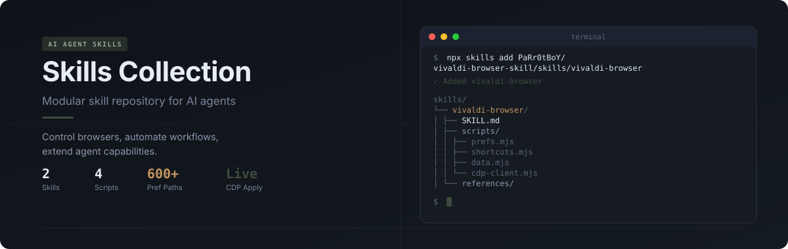

<p align="center">
  
</p>
<p align="center">
  <a href="https://skills.sh/PaRr0tBoY/Techne"></a>
  
  
  
  
</p>


## Quick start

```bash
# Install all skills at once
npx skills@latest add -y -g PaRr0tBoY/Techne
```

**Requirements:** Node.js >= 18 · Python >= 3.10 (for github-base-finder, sync-upstream) · [gh CLI](https://cli.github.com/) (for github-base-finder) · [Vivaldi Browser](https://vivaldi.com/) (for vivaldi-browser only)

---

## What is Techne?

A modular repository of skills and commands for AI coding agents. Each skill is a self-contained directory with a `SKILL.md` definition and supporting scripts. Each command is a prompt template in a `.md` file — drop them into your agent's folder and they work immediately.

Eight skills ship today; the structure is designed for you to add more.

---

## Available skills

<p align="center">
  
</p>

| Skill | What it controls | Key capabilities |
|-------|-----------------|------------------|
| **[vivaldi-browser](skills/vivaldi-browser/)** | Vivaldi browser | 600+ preference paths with live CDP apply · keyboard shortcut management · tab/bookmark/history/download queries · live console capture |
| **[headless-debugger](skills/headless-debugger/)** | Any script | Inject headless mode into interactive scripts (PS/Bash/Python/Node/Go/Ruby) · traverse every user flow · fix parse/runtime errors · CI-ready |
| **[github-base-finder](skills/github-base-finder/)** | GitHub search | PRD decomposition · multi-strategy repo search · candidate evaluation · comparison matrix · batch search · awesome-list mining |
| **[sync-upstream](skills/sync-upstream/)** | Fork sync | Upstream change analysis · conflict detection · interactive HTML report · per-file merge decisions · one-step interactive mode |
| **[agentic-engineer](skills/agentic-engineer/)** | Mechanical engineering | Project plans · budgets · DFM reviews · CAPA · SOP · test plans · equipment sizing · 16 branch commands covering the full engineering document lifecycle |
| **[parrot-design](skills/parrot-design/)** | Design profiles | User-specified design profile (Polaris) · tool-exported tokens in `source/` plus component adapters · cross-profile behavior components (i18n / ARIA / reduced-motion) · anti-templating rules |
| **[memory-transformer](skills/memory/)** | Exam recall | Convert notes / textbook passages / wrong-answer entries into 5 memorizable formats: logic chains · mnemonics · decision trees · comparison tables · keyword formulas · conditions & exceptions · covers 考研 and general coursework |
| **[plan-coach](skills/plan-coach/)** | Anti-procrastination task breakdown | One-line goal → 5-9 emoji + 💡 micro-steps (first physical ≤60s) · 行动锦囊 3-6 anti-stuck tips · optional 免手/hands-free step · zero-install familiar tools only |

---

## How it works

Each skill follows the same structure:

```
skills/
└── skill-name/
    ├── SKILL.md          # Agent instructions
    └── scripts/          # Executable scripts
```

The agent reads `SKILL.md` and executes the scripts automatically. No manual configuration needed.

---

## vivaldi-browser

```bash
npx skills@latest add -y -g PaRr0tBoY/Techne/skills/vivaldi-browser
```

The flagship skill. Four parameterized scripts — no manual JS coding needed.

```bash
# Preferences: read, write, search 600+ paths with instant live-apply
node scripts/prefs.mjs get vivaldi.tabs.bar.position
node scripts/prefs.mjs set vivaldi.tabs.bar.position '"left"'
node scripts/prefs.mjs search theme

# Shortcuts: get, set, list keyboard shortcuts (auto-handles Vivaldi restart)
node scripts/shortcuts.mjs set COMMAND_BREAKMODE_TOGGLE alt+,

# Data: query open tabs, bookmarks, history, downloads
node scripts/data.mjs tabs
node scripts/data.mjs bookmarks github
node scripts/data.mjs history today

# Console: capture live browser output with keyword filter
node scripts/cdp-client.mjs --console -d 10 -f ERROR
```

**How changes apply:** `prefs.mjs set` writes to disk and pushes live via CDP — instant effect, survives restart. `shortcuts.mjs set` auto-closes Vivaldi, modifies, and restarts. `data.mjs` and console auto-launch Vivaldi with debug port if not running.

---

## headless-debugger

```bash
npx skills@latest add -y -g PaRr0tBoY/Techne/skills/headless-debugger
```

Turn any interactive script into a self-testable artifact. Injects a `--headless` / `-Headless` parameter that bypasses all interactive prompts, then traverses every user flow to find and fix bugs — no human interaction needed.

**Supported languages:** PowerShell, Bash, Python, Node.js, Go, Ruby

---

## github-base-finder

```bash
npx skills@latest add -y -g PaRr0tBoY/Techne/skills/github-base-finder
```

Find the best GitHub project to use as a foundation for secondary development, based on a PRD.
Decomposes requirements into search queries, runs multi-strategy GitHub search, evaluates candidates
across 6 dimensions, and produces a comparison matrix with recommendations.

```bash
# Single repo search
python scripts/search.py search "project management kanban" --lang TypeScript --stars 500 --limit 10 --format markdown

# Batch search from JSON file
python scripts/search.py batch queries.json --stars 100 --limit 10 --format markdown

# Detailed repo metadata (README excerpt, release info, topics)
python scripts/search.py detail makeplane/plane --format markdown

# Find repos with shared topics
python scripts/search.py related makeplane/plane --limit 10 --format markdown

# Mine awesome-lists for domain
python scripts/search.py awesome "project management" --limit 5 --format markdown
```

**Workflow:** PRD → decompose features → generate queries → search → enrich → evaluate → compare → recommend

## sync-upstream

```bash
npx skills@latest add -y -g PaRr0tBoY/Techne/skills/sync-upstream
```

Sync your fork with upstream without the guesswork. Analyzes upstream changes, detects conflicts, generates a standalone interactive HTML report, and executes your per-file merge decisions.

```bash
# One-step interactive: analyze → report → serve → execute
python scripts/sync_upstream.py --interactive --branch fix/my-feature

# Step-by-step
python scripts/sync_upstream.py --dry-run --output report.html   # generate report
python scripts/sync_upstream.py --serve --output report.html     # open in browser, block until submit
python scripts/sync_upstream.py --execute decisions.json          # apply decisions
```

**No dependencies:** pure Python stdlib + git CLI. Works on Windows and Unix.

---

## agentic-engineer

```bash
npx skills@latest add -y -g PaRr0tBoY/Techne/skills/agentic-engineer
```

Mechanical engineering assistant toolbox. Covers the full document lifecycle for project plans, budgets, DFM reviews, CAPA, SOP, test plans, equipment sizing, maintenance schedules, and more — 16 branch commands with bilingual templates.

```bash
# Invoke a branch command (examples)
/project-plan   # or /立项 — project proposal
/budget         # or /预算 — budget & cost analysis
/dfm            # or /可制造性 — design for manufacturability review
/capa           # or /纠正预防 — corrective & preventive action
```

**Collaboration modes:** each module adapts its interaction style — direct delivery for routine tasks, teaching for training, iterative for calculations, and structured checklist for inspections.

## parrot-design

```bash
npx skills@latest add -y -g PaRr0tBoY/Techne/skills/parrot-design
```

Design pages, tool pages, components, and interfaces against a user-specified **design profile** — a design language exported from an external design tool. The skill is not auto-invoked; the user calls it manually and must name the scheme:

```text
/skill:parrot-design scheme=polaris
```

Each profile lives in `references/profiles/<scheme>/`: `source/` holds the tool's exported design language (DESIGN doc, tokens, CSS variables), `adapters/` holds this skill's component adaptation rules, and `references/components/` holds cross-profile behavior components (i18n, ARIA, reduced-motion). Tokens and components are reused freely, but pages are assembled from requirements plus components — never wholesale copies of templates.

**Current profiles:** `polaris` (Polaris v7)

---


## plan-coach

```bash
npx skills@latest add -y -g PaRr0tBoY/Techne/skills/plan-coach
```

Zero-friction task-breakdown micro-coach. Turns one vague goal — "想学javascript", "I want to start working out", "通勤路上想练英语口语" — into a Markdown action plan of 5-9 immediately-doable steps, each an emoji action line plus a 💡 one-liner explaining the instant payoff, with a short **行动锦囊** list of anti-procrastination tips. The first step is always a physical ≤60s action so motion starts before motivation arrives; no app installs, sign-ups, or roadmap tables.

```
用户输入 → "想学javascript但一直拖着没开始"

# 学习JavaScript –简易行动计划
### 📁 在桌面新建一个名为 js-learning 的文件夹
> 💡 30秒完成，身体先动起来——启动拖延最强的那一下是动手不是想。
### ✏️ 粘贴 <script>console.log('Hello JavaScript')</script>
### 🌐 浏览器打开按F12看控制台 …
—**行动锦囊**— 每天只做一条 / 卡住先自查5分钟 / 完成30秒小奖励 …
```


---

## Commands

Slash commands for omp / Claude Code. Copy `commands/*.md` to `~/.omp/agent/commands/` (omp) or
`~/.claude/commands/` (Claude Code) to make them available as `/command-name` in any project.

| Command | Purpose |
|---------|--------|
| **[/ask-support](commands/ask-support.md)** | Pause fixing, generate a self-contained technical report for external review |
| **[/you-gon-learn](commands/you-gon-learn.md)** | Post-task retrospective: extract reusable engineering lessons, update AGENTS.md and long-term memory |
| **[/shepherd](commands/shepherd.md)** | Create isolated dev environment from a GitHub Issue/PR (worktree + branch + agent) |
| **[/commitpush](commands/commitpush.md)** | Wrap up dev work: stage relevant files, commit, push, create PR, clean up |
| **[/snapshot](commands/snapshot.md)** | Create a dev checkpoint: commit + annotated tag as a rollback baseline |

---

## Repository structure

```
techne/
├── skills/
│   ├── memory/
│   │   └── SKILL.md
│   ├── agentic-engineer/
│   │   ├── SKILL.md
│   │   ├── scripts/
│   │   └── references/
│   ├── parrot-design/
│   │   ├── SKILL.md
│   │   ├── evals/
│   │   └── references/
│   │       ├── components/
│   │       └── profiles/
│   │           └── polaris/
│   │               ├── manifest.json
│   │               ├── source/
│   │               └── adapters/
│   ├── vivaldi-browser/
│   │   ├── SKILL.md
│   │   └── scripts/
│   │       ├── prefs.mjs
│   │       ├── shortcuts.mjs
│   │       ├── data.mjs
│   │       └── cdp-client.mjs
│   ├── github-base-finder/
│   │   ├── SKILL.md
│   │   ├── scripts/
│   │   └── references/
│   ├── headless-debugger/
│   │   └── SKILL.md
│   └── sync-upstream/
│       ├── SKILL.md
│       └── scripts/
│   ├── plan-coach/
│   │   └── SKILL.md
├── commands/
│   ├── ask-support.md
│   ├── you-gon-learn.md
│   ├── shepherd.md
│   ├── commitpush.md
│   └── snapshot.md
├── assets/
│   └── readme/
│       ├── hero.svg
│       └── section-skills.svg
└── README.md
```
---

## License

MIT
